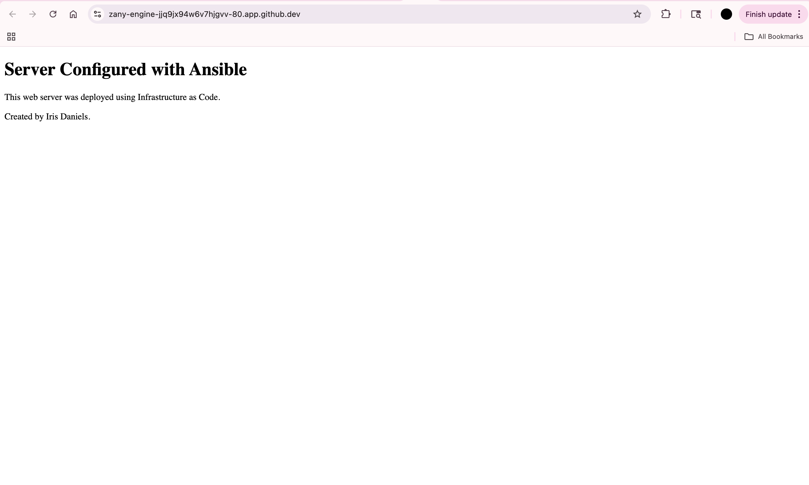
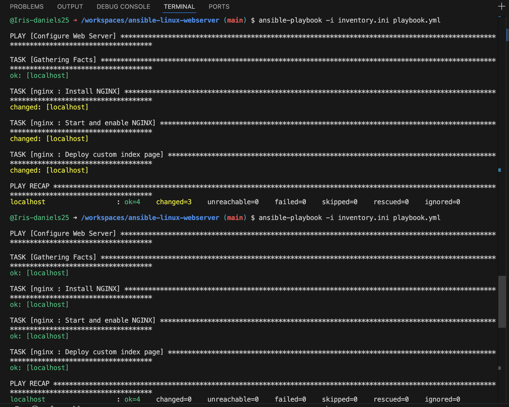

# Ansible Linux Web Server Automation

## Overview

This project demonstrates Infrastructure as Code (IaC) using Ansible to automate the deployment and configuration of an NGINX web server on Ubuntu Linux.

The playbook installs NGINX, ensures the service is running, deploys a custom web page, and verifies that the desired server state is maintained through idempotent execution.

## Technologies Used

* Ansible
* Ubuntu Linux
* NGINX
* YAML
* Jinja2 Templates
* GitHub Codespaces

## Project Structure

```text
ansible-linux-webserver/
├── README.md
├── inventory.ini
├── playbook.yml
├── roles/
│   └── nginx/
│       ├── tasks/
│       │   └── main.yml
│       └── templates/
│           └── index.html.j2
└── screenshots/
```

## How It Works

### Inventory

The inventory defines the target system:

```ini
[webservers]
localhost ansible_connection=local
```

### Playbook

The playbook applies the NGINX role to the web server group:

```yaml
---
- name: Configure Web Server
  hosts: webservers
  become: true

  roles:
    - nginx
```

### Role Tasks

The NGINX role performs the following actions:

1. Installs NGINX
2. Starts the NGINX service
3. Enables NGINX to start automatically
4. Deploys a custom web page using a Jinja2 template

## Screenshots

### Deployed Web Server



### Proof of Idempotency

Running the playbook a second time resulted in:

```text
changed=0
```

This demonstrates Ansible's idempotent behavior, ensuring the system remains in the desired state without making unnecessary changes.



## Verification

NGINX successfully responded to HTTP requests:

```text
HTTP/1.1 200 OK
Server: nginx/1.24.0 (Ubuntu)
```

## Key Concepts Demonstrated

* Infrastructure as Code (IaC)
* Configuration Management
* Linux Administration
* Automation
* Service Management
* Ansible Roles
* Jinja2 Templates
* Idempotent Deployments

## What I Learned

Through this project, I gained hands-on experience using Ansible to automate server configuration and deployment. I learned how inventory files, playbooks, roles, and templates work together to create repeatable and reliable infrastructure automation workflows.

A key takeaway was understanding idempotency—Ansible only makes changes when necessary, allowing the same playbook to be safely executed multiple times while maintaining the desired system state.

## Future Improvements

* Manage multiple web servers
* Configure a firewall using Ansible
* Add SSL/TLS certificates
* Deploy a dynamic application
* Integrate with cloud infrastructure providers such as AWS
# ansible-linux-webserver
Automated Linux web server deployment using Ansible playbooks, roles, templates, and Infrastructure as Code principles.
